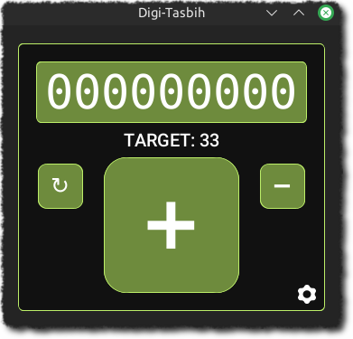

# Digi-Tasbih


## What is this?
Digi-Tasbih is a digital version of Tasbih (تسبيح), which involves the repetition of a phrase "Subhan Allah" (سبحان الله) used to glorify Allah. This app will keep track of your counts, and in the future, you can manage your own goals in this app.

## Additional information
Before running this app, open a command prompt / terminal, and run the following commands

```
pip install customtkinter
pip install playsound
```

The counter has some additional features. By clicking on the screen, you can change the current counts. You can also subtract and reset the counter as well.

By clicking the little cogwheel icon on the bottom-right corner, you can change the current target, change the accent color, and change the beep sound.

## Credit
This app utilizes [CustomTkinter](https://customtkinter.tomschimansky.com/) for the nice graphical user interface, and uses the cross-platform [playsound](https://pypi.org/project/playsound/) to play the beep sound.

### To-Do
- [ ] Add goals
